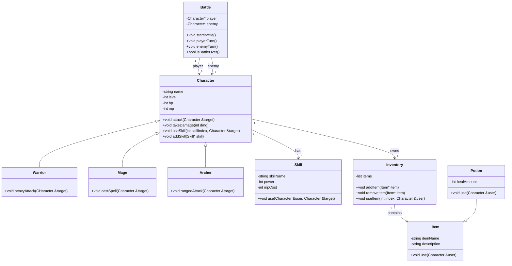

# C++ RPG 游戏系统

## 项目设计类图

```mermaid
classDiagram
    %% Character 类及子类
    class Character {
        -string name
        -int level
        -int hp
        -int mp
        +void attack(Character &target)
        +void takeDamage(int dmg)
        +void useSkill(int skillIndex, Character &target)
        +void addSkill(Skill* skill)
    }

    %% 子类
    class Warrior {
        +void heavyAttack(CHaracter &target)
    }
    class Mage {
        +void castSpell(Character &target)
    }
    class Archer {
        +void rangedAttack(Character &target)
    }

    Character <|-- Warrior
    Character <|-- Mage
    Character <|-- Archer

    %% Skill 类
    class Skill {
        -string skillName
        -int power
        -int mpCost
        +void use(Character &user, Character &target)
    }

    Character "1" --> "*" Skill : has

    %% Item & Inventory
    class Item{
        -string itemName
        -string description
        +void use(Character &user)
    }

    class Inventory {
        -list<Item*> items
        +void addItem(Item* item)
        +void removeItem(Item* item)
        +void useItem(int index, Character &user)
    }

    Character "1" --> "1" Inventory : owns
    Inventory "1" --> "*" Item : contains

    %% Battle 系统
    class Battle {
        -Character* player
        -Character* enemy
        +void startBattle()
        +void playerTurn()
        +void enemyTurn()
        +bool isBattleOver()
    }

    Battle "1" --> "1" Character : player
    Battle "1" --> "1" Character : enemy

    %% 可选扩展类
    class Potion {
        -int healAmount
        +void use(Character &user)
    }

    Potion --|> Item
```

## 目标

练习 C++ 面向对象，模块化设计，以及 Git 分支管理。

## 功能规划

- Character 基类 + 子类 (Warrior, Mage, Archer)
- Skill 类组合到 Character
- 简单战斗逻辑
